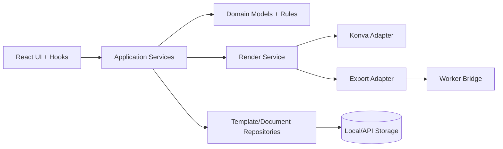

# Invoice & Label Designer — Architecture Audit and Modular Redesign

## 1) Technical Overview

The current system is a React (CRA) application with:
- UI composition in `src/components/*`
- Global editor state in `src/context/CanvasContext.js`
- Element renderers in `src/elements/*`
- Utility-heavy logic in `src/utils/*` (export, templates, placeholders, performance)
- Optional worker entry points in `src/workers/*`

The product supports POS invoice design, receipt templates, and product labels in a single editor workflow.

---

## 2) Full Architectural Audit (Current State)

### Strengths
- Clear separation of visual areas (toolbar, sidebars, canvas, dialogs).
- Rich element model (`text`, `table`, `image`, `barcode`, `qrcode`, shapes, groups).
- Multi-page support and label grid support in state.
- Existing template and export concepts are present.

### Architectural Gaps
- **Monolithic state context**: `CanvasContext` mixes document model, view state, history placeholders, template/image inventory, and feature flags.
- **Tight coupling in rendering path**: `CanvasArea` directly maps domain element types to React-Konva components and interaction behavior in one file.
- **Service logic in UI-adjacent utils**: export/template logic is class-based utility code without explicit ports/interfaces.
- **Duplicate pipeline responsibilities**: variable replacement exists in both placeholder utilities and worker-side processing concepts.
- **Non-uniform async strategy**: worker exists but export flow currently executes primarily on main thread via `exportUtils`.

---

## 3) Dependency and Rendering Pipeline Analysis

### Key Dependencies
- Rendering/UI: `react`, `react-dom`, `react-konva`, `konva`, `react-bootstrap`
- DnD/interaction: `react-dnd`, `react-dnd-html5-backend`, `@hello-pangea/dnd`
- Export: `jspdf`, `jszip`, `html2canvas`
- Data/helper: `lodash`, `date-fns`, `axios`

### Rendering Pipeline (Current)
1. UI interactions dispatch actions via `useCanvas()`.
2. `CanvasContext` reducer mutates page/element state.
3. `CanvasArea` computes visible elements and maps each `element.type` to renderer component.
4. Export dialog calls `exportUtils.exportDesign(...)`.
5. `exportUtils` recreates page drawing on a plain canvas, then serializes to PDF/PNG/JPG/SVG/ZIP.

### Pipeline Risk Points
- Element type switch logic appears in multiple places (canvas + export).
- Export rendering and editor rendering are not driven by one shared element-render contract.
- Performance concerns from large payload updates through one global context.

---

## 4) Bug Detection and Root-Cause Analysis

### Observed Build/Test Issues
- Test failure: Jest cannot parse ESM package (`react-dnd` export syntax).
- Build failure in CI mode because ESLint warnings are treated as errors (`no-unused-vars`, hook dependency issues, missing `default` cases).

### Root Causes
- Test stack (CRA/Jest) is not configured to transform specific ESM modules.
- Significant logic accumulation in large components/contexts produced unused variables and brittle hook dependency arrays.
- Missing strict boundaries between editor core, rendering adapters, and orchestration.

---

## 5) Modular Architecture Redesign (Target)

Use a layered architecture:

- **Domain Layer**: document/page/element schemas, validators, commands.
- **Application Layer**: use-cases/services (`TemplateService`, `RenderService`, `ExportService`, `DocumentService`).
- **Infrastructure Layer**: storage adapters (local/API), worker bridge, export backends.
- **Presentation Layer**: React components + hooks + canvas adapters.

This reduces coupling and makes each business capability testable independently.

---

## 6) Improved Folder Structure

```text
src/
  app/
    providers/
    routes/
  domain/
    document/
      models/
      commands/
      validators/
    template/
      models/
      policies/
    render/
      contracts/
  application/
    services/
      DocumentService.js
      TemplateService.js
      RenderService.js
      ExportService.js
    usecases/
  infrastructure/
    storage/
      LocalTemplateRepository.js
      ApiTemplateRepository.js
    rendering/
      KonvaRendererAdapter.js
      ExportCanvasAdapter.js
    workers/
      ExportWorkerBridge.js
  presentation/
    components/
    hooks/
    state/
      canvasStore.js
  shared/
    utils/
    constants/
    types/
```

---

## 7) Clean Service Layer Abstraction

Recommended service contracts:

- `DocumentService`
  - createPage, deletePage, duplicatePage
  - addElement, updateElement, removeElements
  - validateDocument
- `TemplateService`
  - listTemplates, loadTemplate, saveTemplateVersion
  - resolvePlaceholders(document, dataContext)
- `RenderService`
  - renderEditorFrame(document, viewport)
  - renderExportFrame(document, options)
- `ExportService`
  - export(document, format, options, onProgress)
  - delegates heavy work to worker bridge

Services should be framework-agnostic and invoked by hooks/controllers, not JSX components directly.

---

## 8) Rendering Engine Separation Strategy

Define one **Element Render Contract** used by both editor and export engines:

- Input: normalized `ElementModel`, style map, resolved data.
- Output:
  - Editor path: Konva nodes
  - Export path: Canvas/PDF drawing commands

Benefits:
- single element behavior definition
- consistent output between preview/editor/export
- easier feature extension (new element types added once in registry)

---

## 9) Template Management Strategy

- Version templates (`templateId`, `version`, `schemaVersion`).
- Keep metadata and layout separate:
  - `TemplateMeta` (name, tags, domain: invoice/label/receipt)
  - `TemplateDocument` (pages/elements)
- Use repository pattern:
  - local storage adapter now
  - API adapter later without UI rewrite
- Validate template schema on load and migrate via `schemaVersion`.

---

## 10) Architecture Diagram Explanation



### Diagram Notes
- UI never manipulates raw persistence or export internals directly.
- Services orchestrate business flow and call domain validation.
- Rendering has dual adapters (interactive vs output) sharing contracts.
- Worker bridge handles expensive export processing asynchronously.

---

## 11) Data Flow Description

1. User action -> UI hook dispatches command to Application Service.
2. Service validates command via Domain rules.
3. Document state updated in store.
4. Render Service resolves placeholders + style context.
5. Adapter renders to editor viewport (Konva).
6. On export, same document flows to Export Service -> Worker Bridge -> format adapter.
7. Templates/documents persist through repository adapter.

---

## 12) Extension Guidelines

- Add a new element type by:
  1) extending `ElementModel` schema,
  2) registering editor adapter,
  3) registering export adapter,
  4) adding migration/default config.
- Keep new UI features behind service interfaces; avoid direct reducer sprawl.
- Enforce schema/version checks for all imported templates.

---

## 13) AI-Agent Integration Guide

For AI-assisted ERP customization:
- Expose deterministic service APIs (`TemplateService`, `DocumentService`) for AI calls.
- Provide machine-readable template schema and command catalog.
- Add policy guardrails:
  - no direct file persistence from AI without validation,
  - mandatory schema validation + diff preview,
  - audit logs for generated layout changes.
- Preferred AI flow:
  1) intent -> command plan,
  2) commands -> document mutations,
  3) render preview,
  4) human approval,
  5) persist versioned template.

---

## 14) Future Scalability Plan

### Near-Term (1–2 iterations)
- Split `CanvasContext` into domain store + view store.
- Introduce service layer wrappers around `templateEngine` and `exportUtils`.
- Align placeholder resolution to one shared module.

### Mid-Term
- Move export to dedicated worker pipeline by default.
- Add repository abstraction with API backend support.
- Add template schema migration engine.

### Long-Term (Production-grade ERP Scale)
- Multi-tenant template catalogs with permission model.
- Event-sourced document commands for auditability.
- Background rendering/export queues and job status tracking.
- Plugin SDK for industry-specific invoice/label standards.

---

## 15) Production-Grade Checklist

- Modular boundaries (domain/app/infrastructure/presentation)
- Deterministic render contract across editor/export
- Versioned templates with schema migration
- Worker-first heavy processing
- Service-level validation and auditability
- AI-safe command interfaces and approval workflow

